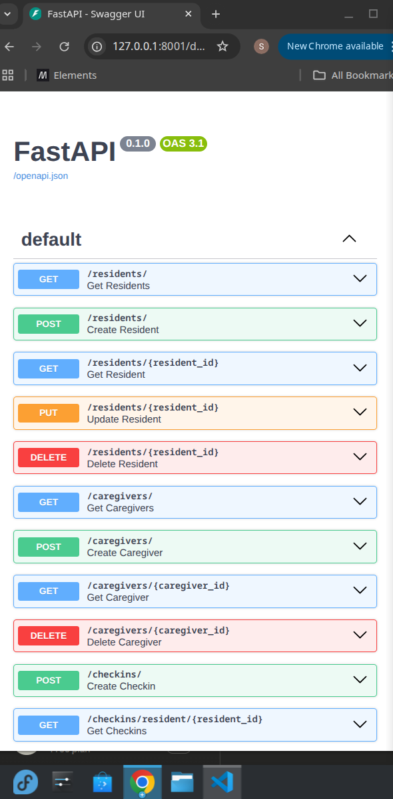
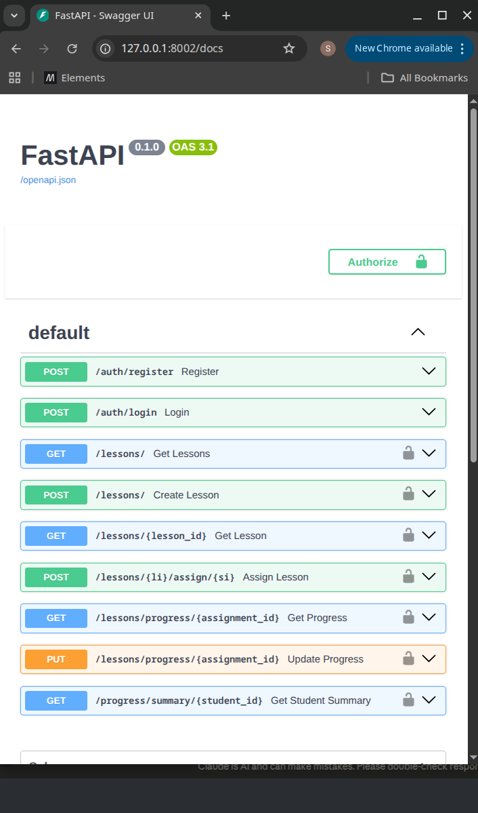
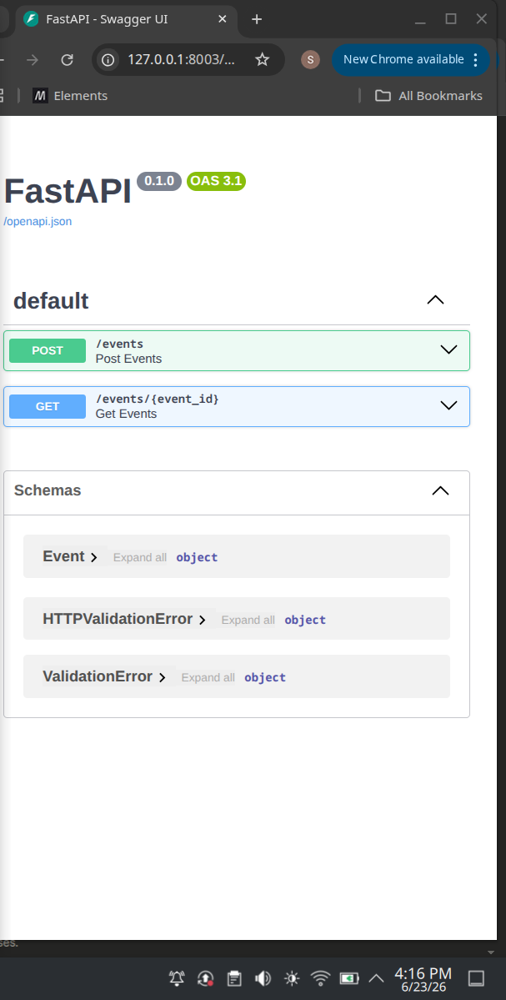
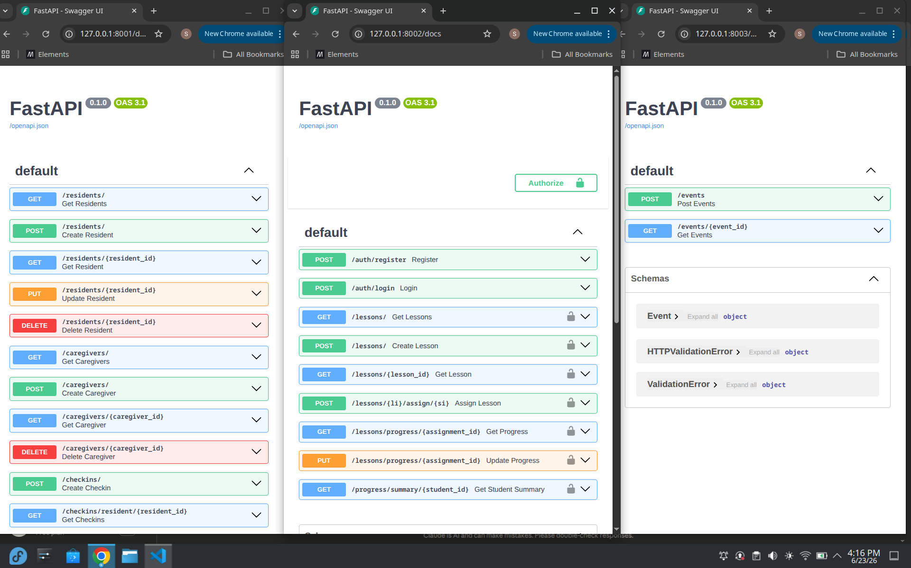
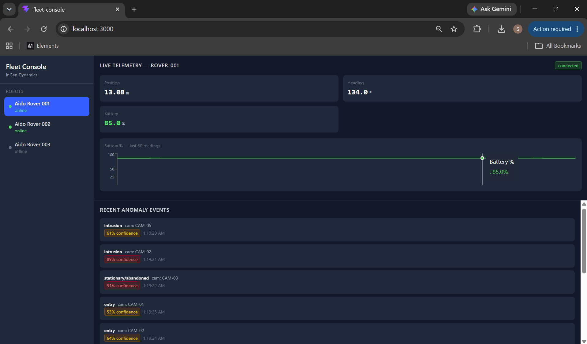

# inGen Dynamics Internship Project Portfolio

This README.md summarizes the services and projects developed during my internship at inGen Dynamics.

## Service Repositories

### [shaun-toolkit](https://github.com/ShaunTheSheep25/shaun-toolkit)  
A foundation for future development, this repository provides a template structure including pyproject.toml, src layout, pytest with coverage, and pre-commit hooks configured for ruff, black, and mypy to ensure high code quality.

### [fari-checkins](https://github.com/ShaunTheSheep25/fari-checkins)  

A REST API designed for an eldercare check-in system, implementing CRUD operations for Residents, Caregivers, and Checkins using FastAPI, SQLAlchemy 2.x, and Pydantic schemas.

### [senpai-lessons](https://github.com/ShaunTheSheep25/senpai-lessons)  

An educational assistant's assignment system, featuring a teacher-student-parent data model, JWT authentication, structured logging, and Alembic migrations for database schema changes.

### [sentinel-events](https://github.com/ShaunTheSheep25/sentinel-events)  

A security monitoring system that processes camera feeds. It features an event ingestion API, an in-memory ring buffer for storage, and WebSockets to broadcast anomaly events to clients in real-time.

### [shaun-stack](https://github.com/ShaunTheSheep25/shaun-stack)  

A fully containerized integration of the prior services. It uses Docker Compose to manage the stack, including persistent database volumes, shared networking, and a unified Makefile to control service operations.

### [aido-telemetry](https://github.com/ShaunTheSheep25/aido-telemetry)  
A ROS 2 Python package specifically for the Aido Rover. It includes publisher and subscriber nodes to handle telemetry data, custom message types, and service nodes for controlling robot parameters.

### [aido-bridge](https://github.com/ShaunTheSheep25/aido-bridge)  
A FastAPI service that acts as a bridge for ROS 2 telemetry. It subscribes to ROS topics via rclpy and exposes this real-time data through REST endpoints and WebSockets, enabling ROS data access without a local ROS installation.

### [fleet-console](https://github.com/ShaunTheSheep25/fleet-console)  

A React-based dashboard built with Vite and Tailwind CSS. It integrates real-time telemetry from the aido-bridge and security event data from sentinel-events, providing a unified view of robot status and anomaly events.
